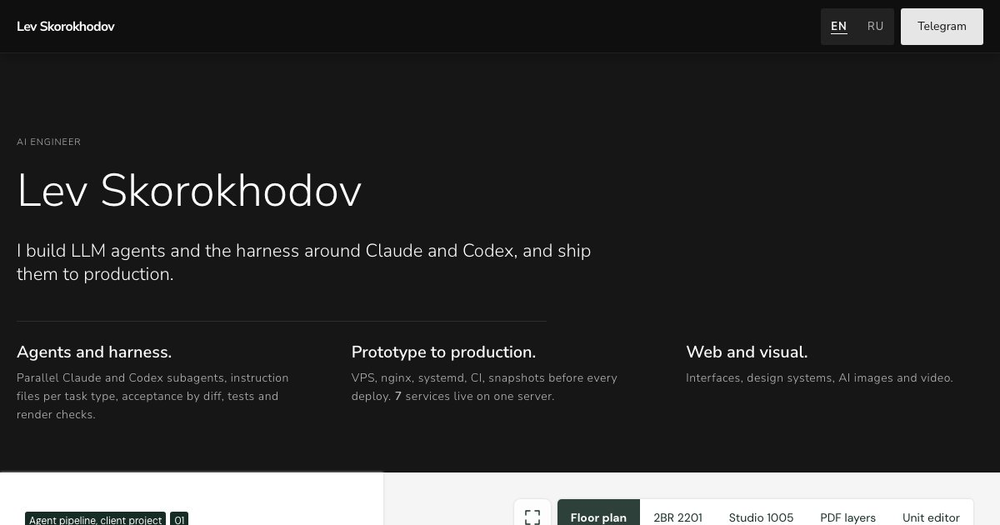

# portfolio

Source of my engineering portfolio page, live at [lab.prfo.design/portfolio](https://lab.prfo.design/portfolio/).

A static page with 7 projects. Each project is a scene built like an apartment picker: a rail with facts on the left, screenshots on the right, a labeled mode switch in the corner and a fullscreen viewer that pages through the project's screenshots. EN and RU, no framework, no build step for the page itself.



## How it was built

- `content.md` is the single source of every visible string in both languages. The build script checks the page against it and fails on any string that is not there, and on any em or en dash.
- `design/SPEC.md` maps my SCENE & RAIL design system to this page: layer A (dark landing) for the shell, layer C (light app surfaces) for the project scenes, exact tokens, fonts and motion.
- Claude Code agents built two directions from the spec in parallel, 3 judges scored them (hiring manager, design system fidelity, front-end craft), the winner was merged with the best parts of the other, and critic agents checked copy, layout at 390 to 1920 px and accessibility before each deploy.

## Structure

| Path | What |
|---|---|
| `site/` | the page: `index.html`, `assets/css`, `assets/js` (language switch, scene modes, fullscreen viewer), `assets/img` (WebP, 1200 and 2400 px), self-hosted fonts |
| `content.md` | all copy, EN and RU, plus scene mode labels |
| `design/SPEC.md` | design spec |
| `tools/site-build.py` | builds `site/index.html` and `assets/js/i18n.js` from `content.md` and checks them |
| `tools/site-images.sh` | turns screenshots from `shots/<project>/` into scene images (the screenshots are not in this repo) |
| `tools/site-shoot.mjs`, `tools/factory-shoot.mjs` | Playwright capture scripts |

## Run

```bash
cd site && python3 -m http.server 8000   # open http://localhost:8000
python3 tools/site-build.py              # rebuild from content.md, run from the repo root
```

## License

Code: MIT, Copyright (c) 2026 Lev Skorokhodov. Screenshots and copy: all rights reserved.
